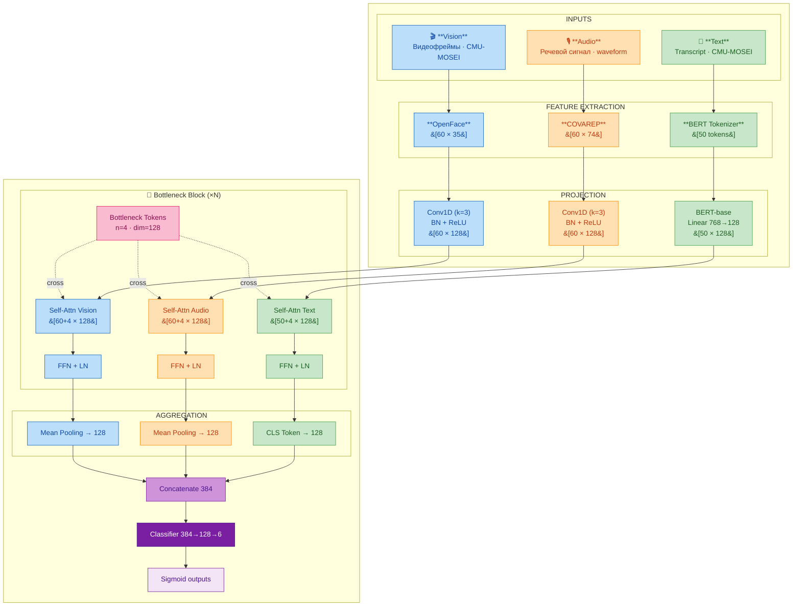

```mermaid
flowchart TB

%% ───────── ROW 1 (INPUTS + FEATURE + PROJECTION) ─────────
subgraph R1[" "]
direction LR

subgraph IN["INPUTS"]
direction TB
V0["🎬 **Vision**\nВидеофреймы · CMU-MOSEI"]:::vis
A0["🎙️ **Audio**\nРечевой сигнал · waveform"]:::aud
T0["📝 **Text**\nTranscript · CMU-MOSEI"]:::txt
end

subgraph FEAT["FEATURE EXTRACTION"]
direction TB
V1["**OpenFace**\n&#91;60 × 35&#93;"]:::vis
A1["**COVAREP**\n&#91;60 × 74&#93;"]:::aud
T1["**BERT Tokenizer**\n&#91;50 tokens&#93;"]:::txt
end

subgraph PROJ["PROJECTION"]
direction TB
V2["Conv1D (k=3)\nBN + ReLU\n&#91;60 × 128&#93;"]:::vis
A2["Conv1D (k=3)\nBN + ReLU\n&#91;60 × 128&#93;"]:::aud
T2["BERT-base\nLinear 768→128\n&#91;50 × 128&#93;"]:::txt
end

end

V0 --> V1 --> V2
A0 --> A1 --> A2
T0 --> T1 --> T2


%% ───────── ROW 2 (BOTTLENECK + AGG + FUSION) ─────────
subgraph R2[" "]
direction LR

subgraph BN["🔴 Bottleneck Block (×N)"]
direction TB
BT["Bottleneck Tokens\nn=4 · dim=128"]:::bn

V3["Self-Attn Vision\n&#91;60+4 × 128&#93;"]:::vis
A3["Self-Attn Audio\n&#91;60+4 × 128&#93;"]:::aud
T3["Self-Attn Text\n&#91;50+4 × 128&#93;"]:::txt

V3b["FFN + LN"]:::vis
A3b["FFN + LN"]:::aud
T3b["FFN + LN"]:::txt

BT -. cross .-> V3
BT -. cross .-> A3
BT -. cross .-> T3

V3 --> V3b
A3 --> A3b
T3 --> T3b
end

subgraph AGG["AGGREGATION"]
direction TB
V4["Mean Pooling → 128"]:::vis
A4["Mean Pooling → 128"]:::aud
T4["CLS Token → 128"]:::txt
end

CAT["Concatenate 384"]:::fuse
CLS["Classifier 384→128→6"]:::cls
OUT["Sigmoid outputs"]:::out

end

%% ───────── FLOW BETWEEN ROWS ─────────
V2 --> V3
A2 --> A3
T2 --> T3

V3b --> V4 --> CAT
A3b --> A4 --> CAT
T3b --> T4 --> CAT

CAT --> CLS --> OUT


%% ───────── STYLES ─────────
classDef vis fill:#bbdefb,stroke:#1565c0,color:#0d47a1
classDef aud fill:#ffe0b2,stroke:#fb8c00,color:#bf360c
classDef txt fill:#c8e6c9,stroke:#43a047,color:#1b5e20
classDef bn  fill:#f8bbd0,stroke:#e91e63,color:#880e4f
classDef fuse fill:#ce93d8,stroke:#7b1fa2,color:#4a148c
classDef cls fill:#7b1fa2,stroke:#4a148c,color:#ffffff
classDef out fill:#f3e5f5,stroke:#7b1fa2,color:#4a148c
```