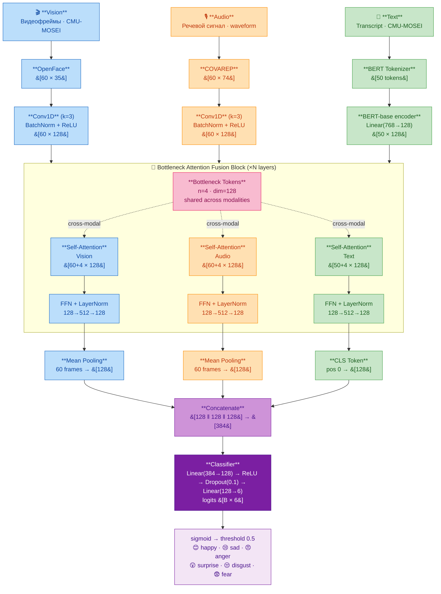

```mermaid
flowchart TD
    %% ── INPUTS ──
    V0["🎬 **Vision**\nВидеофреймы · CMU-MOSEI"]:::vis
    A0["🎙️ **Audio**\nРечевой сигнал · waveform"]:::aud
    T0["📝 **Text**\nTranscript · CMU-MOSEI"]:::txt

    %% ── FEATURE EXTRACTION ──
    V1["**OpenFace**\n&#91;60 × 35&#93;"]:::vis
    A1["**COVAREP**\n&#91;60 × 74&#93;"]:::aud
    T1["**BERT Tokenizer**\n&#91;50 tokens&#93;"]:::txt

    %% ── PROJECTION ──
    V2["**Conv1D** (k=3)\nBatchNorm + ReLU\n&#91;60 × 128&#93;"]:::vis
    A2["**Conv1D** (k=3)\nBatchNorm + ReLU\n&#91;60 × 128&#93;"]:::aud
    T2["**BERT-base encoder**\nLinear(768→128)\n&#91;50 × 128&#93;"]:::txt

    %% ── BOTTLENECK FUSION BLOCK ──
    subgraph BN ["🔴 Bottleneck Attention Fusion Block (×N layers)"]
        direction TB
        BT["**Bottleneck Tokens**\nn=4 · dim=128\nshared across modalities"]:::bn

        V3["**Self-Attention**\nVision\n&#91;60+4 × 128&#93;"]:::vis
        A3["**Self-Attention**\nAudio\n&#91;60+4 × 128&#93;"]:::aud
        T3["**Self-Attention**\nText\n&#91;50+4 × 128&#93;"]:::txt

        V3b["FFN + LayerNorm\n128→512→128"]:::vis
        A3b["FFN + LayerNorm\n128→512→128"]:::aud
        T3b["FFN + LayerNorm\n128→512→128"]:::txt

        BT -. cross-modal .-> V3
        BT -. cross-modal .-> A3
        BT -. cross-modal .-> T3

        V3 --> V3b
        A3 --> A3b
        T3 --> T3b
    end

    %% ── AGGREGATION ──
    V4["**Mean Pooling**\n60 frames → &#91;128&#93;"]:::vis
    A4["**Mean Pooling**\n60 frames → &#91;128&#93;"]:::aud
    T4["**CLS Token**\npos 0 → &#91;128&#93;"]:::txt

    %% ── FUSION & CLASSIFICATION ──
    CAT["**Concatenate**\n&#91;128 ‖ 128 ‖ 128&#93; → &#91;384&#93;"]:::fuse
    CLS["**Classifier**\nLinear(384→128) → ReLU → Dropout(0.1) → Linear(128→6)\nlogits &#91;B × 6&#93;"]:::cls
    OUT["sigmoid → threshold 0.5\n😊 happy · 😢 sad · 😠 anger\n😲 surprise · 😒 disgust · 😨 fear"]:::out

    %% ── FLOW ──
    V0 --> V1 --> V2 --> BN
    A0 --> A1 --> A2 --> BN
    T0 --> T1 --> T2 --> BN

    V3b --> V4
    A3b --> A4
    T3b --> T4

    V4 --> CAT
    A4 --> CAT
    T4 --> CAT

    CAT --> CLS --> OUT

    %% ── STYLES ──
    classDef vis fill:#bbdefb,stroke:#1565c0,color:#0d47a1
    classDef aud fill:#ffe0b2,stroke:#fb8c00,color:#bf360c
    classDef txt fill:#c8e6c9,stroke:#43a047,color:#1b5e20
    classDef bn  fill:#f8bbd0,stroke:#e91e63,color:#880e4f
    classDef fuse fill:#ce93d8,stroke:#7b1fa2,color:#4a148c
    classDef cls fill:#7b1fa2,stroke:#4a148c,color:#ffffff
    classDef out fill:#f3e5f5,stroke:#7b1fa2,color:#4a148c
```